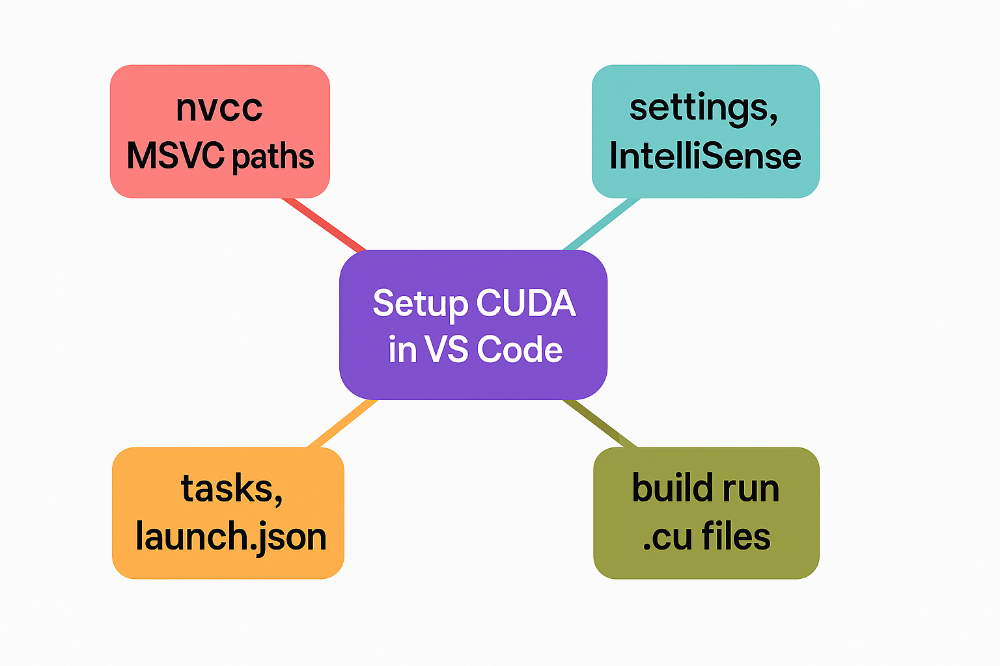

# Simple Setting Up a CUDA Development Environment in VS Code in Windows 

https://www.pirahansiah.com/farshid/content/VSCodeCUDAwindows/ 


🚀 Setting Up a CUDA Development Environment in VS Code (Windows)

If you’re working with CUDA C++ and want a clean and efficient workflow inside Visual Studio Code, this guide shows how to configure tasks and launch settings to build and debug .cu files using nvcc and the MSVC toolchain.

Below is a breakdown of how the key configuration files come together.

⸻

🛠️ tasks.json – Automating the Build Process
```
{
  "version": "2.0.0",
  "tasks": [
    {
      "label": "Build CUDA Project",
      "type": "shell",
      "command": "nvcc",
      "args": [
        "-I",
        "C:\\Program Files\\Microsoft Visual Studio\\2022\\Enterprise\\VC\\Tools\\MSVC\\14.42.34433\\include",
        "-L",
        "C:\\Program Files\\Microsoft Visual Studio\\2022\\Enterprise\\VC\\Tools\\MSVC\\14.42.34433\\lib\\x64",
        "${workspaceFolder}/main.cu",
        "-o",
        "${workspaceFolder}/main.exe"
      ],
      "group": {
        "kind": "build",
        "isDefault": true
      },
      "problemMatcher": []
    }
  ]
}
```

This task uses nvcc to compile a CUDA file (main.cu) and links it against MSVC libraries. It’s defined as the default build task, making it easy to trigger with Ctrl + Shift + B.

⸻

💡 settings.json – File Associations & Terminal Preferences
```
{
  "files.associations": {
    "*.cu": "cpp"
  },
  "terminal.integrated.shell.windows": "cmd.exe"
}
```
This helps VS Code:
	•	Treat .cu files as C++ for syntax highlighting, IntelliSense, and formatting.
	•	Use the Windows Command Prompt (cmd.exe) as the integrated terminal for consistency with the Windows toolchain.

⸻

🧪 launch.json – Debugging the Executable
```
{
  "version": "0.2.0",
  "configurations": [
    {
      "name": "Build and Run CUDA",
      "type": "cppvsdbg",
      "request": "launch",
      "preLaunchTask": "Build CUDA Project",
      "program": "${workspaceFolder}/main.exe",
      "args": [],
      "stopAtEntry": false,
      "cwd": "${workspaceFolder}",
      "environment": [],
      "console": "externalTerminal"
    }
  ]
}
```
This debug configuration will:
	•	Automatically build the project before running (preLaunchTask)
	•	Run the resulting main.exe in an external terminal
	•	Use the Visual Studio debugger (cppvsdbg) for a seamless experience

⸻

📘 c_cpp_properties.json – IntelliSense Setup
```
{
  "configurations": [
    {
      "name": "Windows",
      "includePath": [
        "${workspaceFolder}",
        "C:/Program Files/Microsoft Visual Studio/2022/Enterprise/VC/Tools/MSVC/14.42.34433/include",
        "C:/Program Files (x86)/Windows Kits/10/Include/10.0.22621.0/ucrt"
      ],
      "defines": [],
      "windowsSdkVersion": "10.0.22621.0",
      "compilerPath": "C:/Program Files/NVIDIA GPU Computing Toolkit/CUDA/v12.6/bin/nvcc.exe",
      "cStandard": "c17",
      "cppStandard": "c++17",
      "intelliSenseMode": "windows-msvc-x64"
    }
  ],
  "version": 4
}
```
This enables:
	•	Full IntelliSense for C++ and CUDA code
	•	Accurate error highlighting
	•	Auto-completion based on both CUDA and MSVC headers

⸻

✅ Summary

With this setup:
	•	You can build and run CUDA projects with a single shortcut
	•	Syntax highlighting and IntelliSense work properly
	•	Debugging is fully integrated

This config is especially useful for developers who prefer the lightweight and customizable nature of VS Code over heavier IDEs like Visual Studio.

⸻

🙋 Tips & Improvements:
	•	Use ${env:CUDA_PATH} instead of hardcoding the CUDA path
	•	Add more args like -g for debug symbols
	•	For larger projects, consider using CMake + CMake Tools extension

⸻
