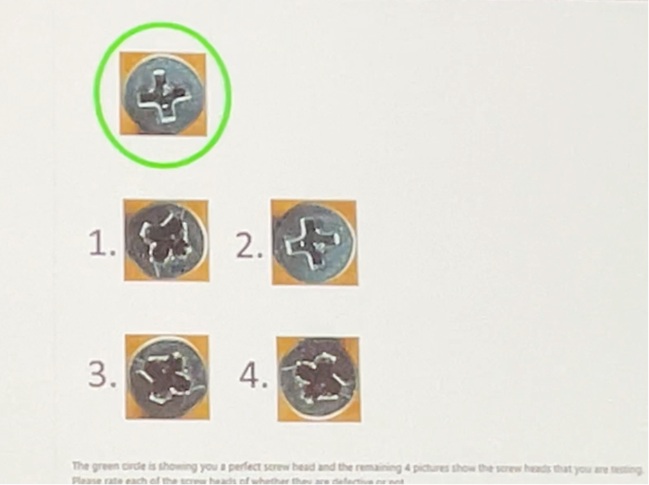

# {{ site.author }}  

# coursera video RAG


# Ollama + Vision


# Where LLMs Meet Computer Vision: Unlocking Multimodal AI


AI models like GPT-4 Turbo, Google Gemini 1.5 Pro, and Claude 3 Opus offer advanced multimodal processing, each excelling in specific tasks from text generation to image analysis. Their pricing varies based on token usage, making it essential to choose the model that best fits your project’s needs.

### AI Model Cost Calculator: Optimizing Costs for Computer Vision and Multimodal AI Solutions

My AI Model Cost Calculator with the latest pricing for GPT-4 Turbo, Google Gemini 1.5 Pro, and Claude 3 Opus! 💡 Calculate text and image processing costs easily with real-time estimates. Check it out! #AI #MachineLearning #CostCalculator #GPT4 #Claude #GoogleGemini
- [AI Model Cost Calculator: Optimizing Costs for Computer Vision and Multimodal AI Solutions](/farshid/portfolio/projects/AI_Model_Cost_Calculator.html)


### How image to token

- [https://community.openai.com/t/how-do-i-calculate-image-tokens-in-gpt4-vision/492318](https://community.openai.com/t/how-do-i-calculate-image-tokens-in-gpt4-vision/492318 )
- [https://platform.openai.com/docs/guides/vision](https://platform.openai.com/docs/guides/vision)

``` py
from math import ceil

def resize(width, height):
    if width > 1024 or height > 1024:
        if width > height:
            height = int(height * 1024 / width)
            width = 1024
        else:
            width = int(width * 1024 / height)
            height = 1024
    return width, height

def count_image_tokens(width: int, height: int):
    width, height = resize(width, height)
    h = ceil(height / 512)
    w = ceil(width / 512)
    total = 85 + 170 * h * w
    return total

```

#### Microsoft AI

token costs associated with processing images using GPT-4 Turbo with Vision capabilities

    1.	Low Mode:
    The image is processed for a fixed cost of 85 tokens.
    2.	High Mode:
    •	The image is first scaled to fit within a 2048 x 2048 pixel square.
    •	Then, the shortest side is resized to 768 pixels.
    •	The model calculates how many 512-pixel squares the image consists of.
    •	The total cost is calculated by multiplying the number of squares by 170 tokens and adding 85 tokens as the base.

https://portal.azure.com/#browse/Microsoft.MachineLearningServices%2Faistudio 
 doc+images+content>add your data>visual search>gpt4
Image inputs are metered and charged in tokens


#### OpenAI

token costs associated with processing images using GPT-4 Turbo with Vision capabilities

OpenAI’s GPT-4 Turbo with Vision capabilities enables various applications, including optical character recognition (OCR) and detailed image analysis. The pricing for these image-based interactions varies based on image size. For instance, a 1080x1080 pixel image costs $0.00765 per image to process in vision mode. This feature is part of the multimodal capabilities added to GPT-4 Turbo, making it a powerful tool for developers to integrate both text and image inputs into their applications


### RAG for image and videos


### Fine tune 


### Use cases 
- [https://cookbook.openai.com/examples/gpt_with_vision_for_video_understanding ](https://cookbook.openai.com/examples/gpt_with_vision_for_video_understanding )

Seeing AI


### IoT and Robotics 
- []()


### Medical Image Processing


## Video with LLM

how to build and implement Retrieval-Augmented Generation (RAG) systems using multimodal data such as text, images, audio, and video. It covers various techniques like contrastive learning to train models that can retrieve information across multiple modalities. The course guides learners through creating any-to-any search systems, where you can input data in one form (e.g., an image) and retrieve related data in other formats (e.g., text or video).

Some of the key takeaways include:

Building multimodal RAG systems that retrieve and reason over multimodal data to generate contextually relevant responses.
Training models to process multimodal inputs, allowing for seamless retrieval and reasoning.
Implementing real-world applications, such as analyzing documents like invoices and creating multimodal recommender systems.


### Microsoft AI
Image
Context is everything
PowerBI
Graphs to code
Defect detection



- []()

Seeing AI

### Zero-shot prompting
### Few-shot prompting
### Context window


### 


### 
- []()


### 


### 


### 
- []()


### 


### 


### 
- []()
Seeing AI
